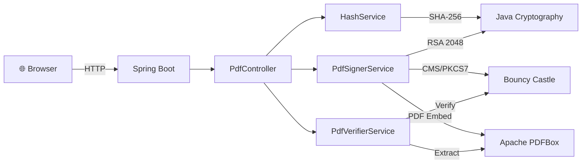

<div align="center">

<!-- Animated SVG Header -->
<svg xmlns="http://www.w3.org/2000/svg" viewBox="0 0 800 200" width="800" height="200">
  <defs>
    <linearGradient id="grad1" x1="0%" y1="0%" x2="100%" y2="0%">
      <stop offset="0%" style="stop-color:#4facfe;stop-opacity:1">
        <animate attributeName="stop-color" values="#4facfe;#00f2fe;#4facfe" dur="3s" repeatCount="indefinite"/>
      </stop>
      <stop offset="100%" style="stop-color:#00f2fe;stop-opacity:1">
        <animate attributeName="stop-color" values="#00f2fe;#4facfe;#00f2fe" dur="3s" repeatCount="indefinite"/>
      </stop>
    </linearGradient>
  </defs>
  <rect width="800" height="200" rx="20" fill="#0b1120"/>
  <text x="400" y="90" font-family="Arial, sans-serif" font-size="50" font-weight="bold" fill="url(#grad1)" text-anchor="middle">🛡️ PDF Shield Pro</text>
  <text x="400" y="140" font-family="Arial, sans-serif" font-size="20" fill="#94a3b8" text-anchor="middle">Digital Signature Tool for PDF Documents</text>
  <text x="400" y="175" font-family="Arial, sans-serif" font-size="14" fill="#64748b" text-anchor="middle">Cryptography & Network Security • Academic Project</text>
</svg>

<br/>

<!-- Badges -->


<br/>

**A complete end-to-end Digital Signature system that ensures Authenticity, Integrity, and Non-Repudiation of PDF documents.**

[🚀 Quick Start](#-quick-start) •
[📖 How It Works](#-how-it-works) •
[🏗️ Architecture](#️-architecture) •
[🧪 Demo](#-demo)

</div>

---

## ✨ Features

<table>
<tr>
<td width="50%">

### 🔐 Digital Signing
- Upload any PDF document
- Generate **2048-bit RSA** key pair
- Create **PKCS#7/CMS** compliant signature
- Download the sealed & signed PDF
- Self-signed X.509 certificate embedded

</td>
<td width="50%">

### 🔍 Signature Verification
- Upload any signed PDF
- Extract embedded signature & certificate
- **Side-by-side hash comparison**
- Detect document tampering instantly
- View signer identity & timestamp

</td>
</tr>
</table>

---

## 📖 How It Works

### The 3 Pillars of Security

| Pillar | What It Proves | How We Achieve It |
|:------:|:--------------|:-----------------|
| 🔑 **Authenticity** | *"This was signed by who they claim to be"* | RSA Key Pair + X.509 Certificate |
| 🧬 **Integrity** | *"This document hasn't been changed"* | SHA-256 Hash Comparison |
| 📝 **Non-Repudiation** | *"The signer cannot deny signing this"* | Private Key is unique to the signer |

### The Signing Process (Sender Side)

```
📄 Original PDF
     │
     ▼
┌─────────────────────┐
│  SHA-256 Hashing     │  ──▶  Unique Fingerprint: "A1B2C3..."
└─────────────────────┘
     │
     ▼
┌─────────────────────┐
│  RSA Key Generation  │  ──▶  🔑 Private Key + 🔓 Public Key
└─────────────────────┘
     │
     ▼
┌─────────────────────┐
│  Digital Signing     │  ──▶  Hash encrypted with Private Key
└─────────────────────┘
     │
     ▼
┌─────────────────────┐
│  PDF Embedding       │  ──▶  Signature + Certificate sealed inside PDF
└─────────────────────┘
     │
     ▼
📄 Signed PDF (Ready to send!)
```

### The Verification Process (Receiver Side)

```
📄 Received Signed PDF
     │
     ├──────────────────┐
     ▼                  ▼
┌──────────┐    ┌──────────────┐
│ Extract  │    │ Calculate    │
│ Stored   │    │ Fresh        │
│ Hash     │    │ SHA-256 Hash │
│ (from    │    │ (from file)  │
│ signature)│    │              │
└──────────┘    └──────────────┘
     │                  │
     ▼                  ▼
   "A1B2C3"    ==    "A1B2C3"   ──▶  ✅ MATCH = Document is Authentic!
   "A1B2C3"    !=    "X9Y8Z7"   ──▶  ❌ MISMATCH = Document Tampered!
```

---


### File Structure

```
Cns_project/
├── 📄 pom.xml                          # Maven config & dependencies
├── 📄 README.md                        # You are here!
├── 📁 docs/
│   └── 🖼️ project_flow.png             # Architecture diagram
└── 📁 src/main/
    ├── 📁 java/com/cns/project/
    │   ├── ⚙️ CnsProjectApplication.java   # Spring Boot entry point
    │   ├── 🧬 HashService.java             # SHA-256 hashing engine
    │   ├── 🔐 PdfSignerService.java        # RSA signing + PDF embedding
    │   ├── 🔍 PdfVerifierService.java       # Signature verification engine
    │   └── 🌐 PdfController.java           # REST API endpoints
    └── 📁 resources/static/
        └── 🎨 index.html                   # Premium Web Dashboard
```

### Technology Stack



---

## 🧪 Demo

### Signing a Document
> 1. Upload a PDF → System generates SHA-256 hash
> 2. Enter your name → RSA key pair created internally
> 3. Click "Sign" → PKCS#7 signature embedded in PDF
> 4. Download your signed document! ✅

### Verifying a Document
> 1. Switch to "Verify" tab
> 2. Upload a signed PDF
> 3. System extracts the **Stored Hash** and calculates the **Fresh Hash**
> 4. If both hashes match → **✅ CERTIFICATE VERIFIED**
> 5. If they don't match → **❌ INTEGRITY BREACH**

---

## 🚀 Quick Start

### Prerequisites

| Tool | Version | Check Command |
|:-----|:--------|:-------------|
| Java JDK | 17 or higher | `java -version` |
| Apache Maven | 3.9+ | `mvn -version` |

### Installation & Run

```bash
# 1. Clone the repository
git clone <repo-url>
cd Cns_project

# 2. Build and run
mvn spring-boot:run

# 3. Open in browser
# Visit: http://localhost:8080
```

---

## 🔧 API Reference

| Method | Endpoint | Description | Input |
|:------:|:---------|:-----------|:------|
| `POST` | `/api/pdf/hash` | Generate SHA-256 hash | `file` (PDF) |
| `POST` | `/api/pdf/sign-pdf` | Sign & download PDF | `file` (PDF), `signerName` (text) |
| `POST` | `/api/pdf/verify-pdf` | Verify signature | `file` (Signed PDF) |

---

## 🔬 Algorithms Used

### SHA-256 (Hashing)
- **Type:** Cryptographic Hash Function
- **Output:** 256-bit (64 hex characters)
- **Purpose:** Creates a unique fingerprint of the document
- **Property:** Even a 1-bit change produces a completely different hash

### RSA-2048 (Encryption)
- **Type:** Asymmetric Key Encryption
- **Key Size:** 2048 bits
- **Purpose:** Encrypts the hash with Private Key
- **Security:** Would take billions of years to crack with current technology

### PKCS#7 / CMS (Container)
- **Type:** Cryptographic Message Syntax
- **Purpose:** Standard format recognized by Adobe, Edge, and all PDF readers
- **Contains:** Digital Signature + X.509 Certificate + Timestamp

---

## 📚 CNS Concepts Demonstrated

| # | Concept | Implementation |
|:-:|:--------|:--------------|
| 1 | Symmetric vs Asymmetric Encryption | RSA (Asymmetric) key pair generation |
| 2 | Hashing | SHA-256 document fingerprinting |
| 3 | Digital Signatures | RSA signing of document hash |
| 4 | Certificate Authority (Self-Signed) | X.509 certificate generation |
| 5 | Message Integrity | Hash comparison (stored vs calculated) |
| 6 | Non-Repudiation | Private key uniqueness |
| 7 | Public Key Infrastructure | Certificate embedded in signed PDF |

---

<div align="center">

### 🛡️ Built with ❤️ for CNS Academic Project


**Java** • **Spring Boot** • **Apache PDFBox** • **Bouncy Castle**

<sub>Cryptography & Network Security • Semester 6 • 2026</sub>

</div>
